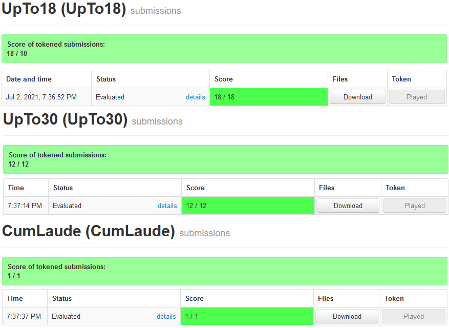

# dijkstra
[dijkstra](http://www.csl.mtu.edu/cs4321/www/Lectures/Lecture%2020%20-%20Dijkstra%20Algorithm.htm) implementation in C done for fun proposed by the course of API of the year 2020/2021 at the Politecnico di Milano.
The full description of the problem is given in the pdf file.
## Description
Since it is impossible to know beforehand if the graph is dense or sparse I used a matrix to store the graph, which leads to O(n^2) complexity both spatial and temporal. Then to compute the SPT from 0 to all the other nodes, I used Dijkstra with a priority queue implemented with a min-heap, which leads to a complexity of O(n^2 log(n)). Lastly, to memorize the TopK graphs with the minimum sum of all paths, I used a max heap to store the graphs already read. This lead to a complexity of O(log(TopK)) for each new graph and O(TopK) to print them all. the final complexity divided for each command is:

add graph: O(n^2 log(n) + log(TopK))
show TopK: O(TopK)
<!-- ## Results
As shown in the image below this implementation passed all the tests
 -->
